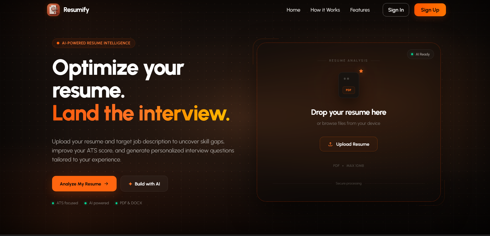
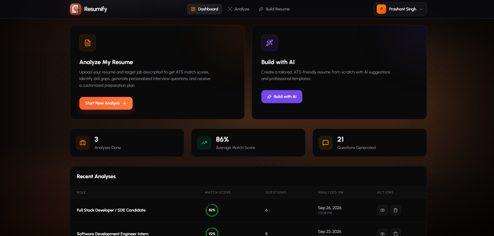
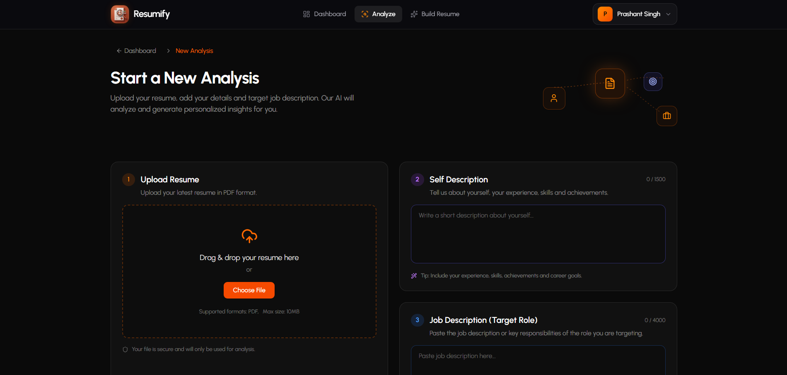
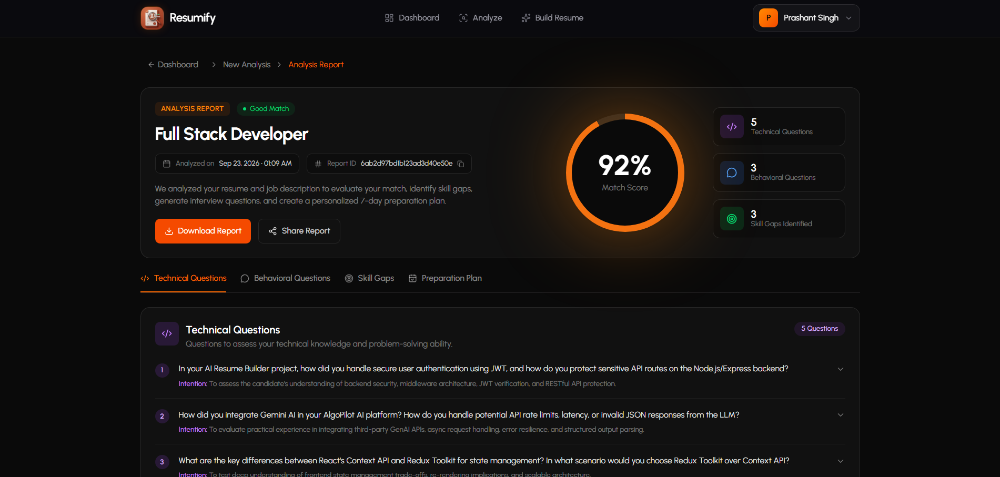
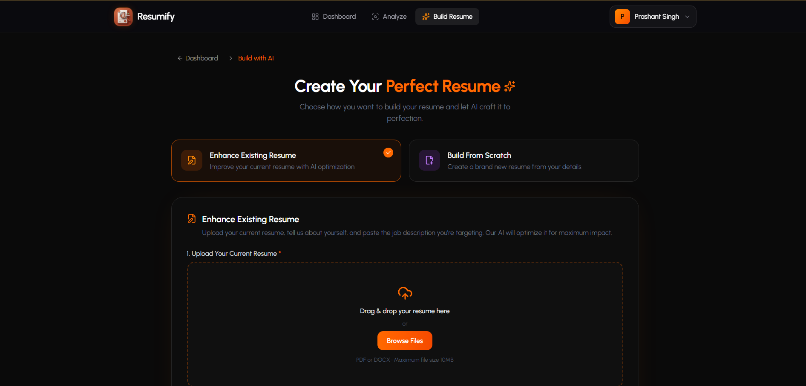
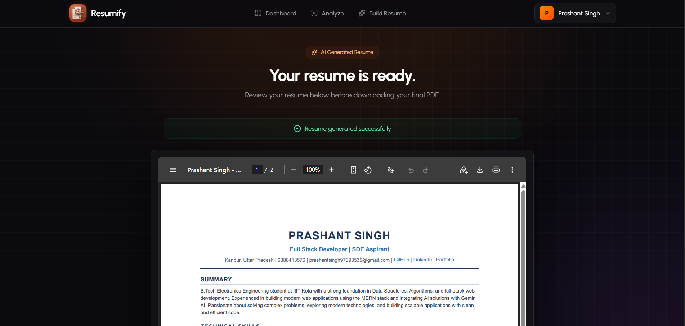

# 🚀 Resumify

### AI-Powered Resume Analysis, Optimization & Building Platform

Resumify is a full-stack AI-powered platform designed to help users **analyze, improve, and build professional resumes**.

Users can upload an existing resume for AI-powered analysis and interview preparation, or create an optimized resume from an existing resume or completely from scratch.

---

## ✨ Features

### 📊 Resume Analysis

Upload your resume along with an optional target job description and get an AI-powered analysis.

* Resume & job description analysis
* Match score
* Strengths identification
* Areas for improvement
* Technical interview questions
* Behavioral interview questions
* Job-focused insights

---

### ✨ Build With AI

Create or improve your resume using AI.

#### Enhance Existing Resume

Upload an existing resume and provide:

* Self description / introduction
* Target job description

Resumify processes the information and generates an optimized resume.

#### Build From Scratch

Create a resume by providing structured information such as:

* Personal information
* Professional title
* Professional summary
* Education
* Technical skills
* Work experience
* Projects
* Certifications
* Achievements
* Career goals
* Target job description

The information is then processed by AI to generate a professional, ATS-friendly resume.

---

### 📄 Resume Preview & PDF Export

After generating a resume, users can:

* Preview the generated resume
* Review the final content
* Download the resume as a PDF

PDF generation is handled on the backend using Puppeteer.

---

### 🔐 Authentication

Resumify includes secure user authentication using:

* JWT-based authentication
* Protected routes
* Authentication-aware navigation
* Login and signup flows
* API-level authentication

---

### 🎨 Modern User Interface

The application focuses on a clean and modern SaaS-style experience with:

* Responsive design
* Dark UI
* Glassmorphism elements
* Smooth animations
* Framer Motion interactions
* Scroll-based UI effects
* Responsive dashboards
* Interactive resume generation flows

---

# 🖥️ Screenshots


## 🏠 Landing Page

<!-- Add your screenshot here -->



---

## 📊 Dashboard

<!-- Add your screenshot here -->



---

## 📄 Resume Analysis




---

## 🎯 Interview Report



---

## 📝 Build Resume From Scratch




---

## 👀 Resume Preview



---

# 🔄 How Resumify Works

```text
                    ┌─────────────────┐
                    │     Resumify    │
                    └────────┬────────┘
                             │
                             ▼
                    ┌─────────────────┐
                    │     Sign Up     │
                    │    / Log In     │
                    └────────┬────────┘
                             │
                 ┌───────────┴───────────┐
                 │                       │
                 ▼                       ▼
        ┌─────────────────┐     ┌─────────────────┐
        │  Analyze Resume │     │  Build With AI  │
        └────────┬────────┘     └────────┬────────┘
                 │                       │
                 ▼                ┌──────┴──────┐
        ┌─────────────────┐       │             │
        │ Upload Resume + │       ▼             ▼
        │ Job Description │  ┌──────────┐ ┌──────────────┐
        └────────┬────────┘  │ Enhance  │ │ Build From   │
                 │           │ Existing │ │ Scratch      │
                 │           └────┬─────┘ └──────┬───────┘
                 │                │              │
                 └────────────────┼──────────────┘
                                  ▼
                         ┌─────────────────┐
                         │   AI Processing │
                         └────────┬────────┘
                                  │
                                  ▼
                         ┌─────────────────┐
                         │ Resume / Report │
                         └────────┬────────┘
                                  │
                                  ▼
                         ┌─────────────────┐
                         │ Preview / PDF   │
                         └─────────────────┘
```

---

# 🛠️ Tech Stack

## Frontend

* React.js
* React Router
* Tailwind CSS
* Framer Motion
* Lucide React
* Axios

## Backend

* Node.js
* Express.js
* MongoDB
* Mongoose
* JWT Authentication

## AI

* Google Gemini API

## PDF & File Processing

* Puppeteer
* PDF parsing
* PDF generation

## Development Tools

* Git
* GitHub
* VS Code
* Postman

---

# 🏗️ Project Structure

```text
Resumify/
│
├── client/
│   ├── src/
│   │   ├── components/
│   │   ├── pages/
│   │   ├── hooks/
│   │   ├── context/
│   │   ├── services/
│   │   └── ...
│   │
│   └── package.json
│
├── server/
   ├── src/
   │   ├── controllers/
   │   ├── models/
   │   ├── routes/
   │   ├── middlewares/
   │   ├── services/
   │   ├
   │   └── ...
   │
   └── package.json


```

---

# ⚙️ Getting Started

## 1. Clone the Repository

```bash
git clone https://github.com/YOUR_USERNAME/resumify.git

cd resumify
```

---

## 2. Install Dependencies

### Frontend

```bash
cd client
npm install
```

### Backend

```bash
cd ../server
npm install
```

---

# 🔐 Environment Variables

Create a `.env` file inside the backend directory.

```env
PORT=3000

MONGO_URI=your_mongodb_connection_string

JWT_SECRET=your_jwt_secret

GEMINI_API_KEY=your_gemini_api_key

CLIENT_URL=http://localhost:5173
```


# ▶️ Running the Application

Start the backend:

```bash
cd server
npm run dev
```

Start the frontend in another terminal:

```bash
cd client
npm run dev
```

The application should now be available through the local development URL shown by Vite.

---

# 🧠 AI Workflow

Resumify uses AI in multiple parts of the application.

### Resume Analysis

```text
Resume PDF
     +
Job Description
     ↓
PDF Text Extraction
     ↓
AI Processing
     ↓
Resume Analysis
     ↓
Strengths + Improvements
     ↓
Technical + Behavioral Questions
```

### Resume Generation

```text
Candidate Information
        +
Professional Summary
        +
Skills / Education / Projects
        +
Optional Job Description
        ↓
Gemini AI
        ↓
Structured Resume HTML
        ↓
Puppeteer
        ↓
PDF Resume
        ↓
Resume Preview
        ↓
Download
```

---

# 🔒 Security

The application implements authentication and protected resources using JWT.

Sensitive configuration such as:

* Database credentials
* JWT secrets
* AI API keys
* Third-party service credentials

should be stored using environment variables.

---

# 🚧 Future Improvements

Some improvements planned for future versions include:

* [ ] Persistent generated resume storage
* [ ] Resume version history
* [ ] Multiple resume templates
* [ ] More detailed ATS analysis
* [ ] Resume scoring improvements
* [ ] Job-specific resume optimization
* [ ] Resume comparison
* [ ] Public resume sharing
* [ ] More AI-powered career recommendations
* [ ] Improved analytics dashboard
* [ ] Resume customization controls

---

# 🎯 Project Goals

The goal of Resumify is to make resume preparation more structured by combining:

**Resume Analysis + AI Optimization + Resume Building + Interview Preparation**

into a single platform.

---

# 👨‍💻 Author

### Prashant Singh

**Full Stack Developer | DSA & Problem Solving | AI & GenAI Enthusiast**

B.Tech — Electronics Engineering
Indian Institute of Information Technology, Kota

GitHub: `https://github.com/prashantsingh4056`

---

## ⭐ If you find this project interesting

Consider giving the repository a ⭐ on GitHub!

Feedback and suggestions are always welcome.

---
